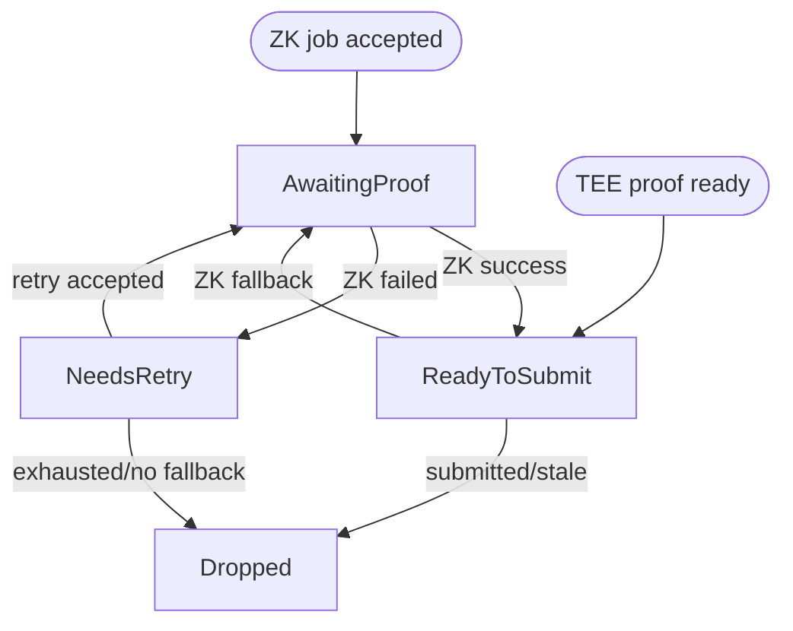

# Challenger

The challenger is an offchain service that protects the proof system by independently checking
in-progress `AggregateVerifier` games against canonical L2 state. When it finds an invalid
checkpoint root, it obtains the proof material required by the game contract and submits a dispute
transaction on L1.

The challenger is permissionless in the ZK path: any operator with access to canonical L1 and L2
RPCs, a ZK proving service, and an L1 transaction signer can run it. Base may also run a challenger
with access to a TEE proof endpoint so invalid TEE-backed games can be nullified on a faster path
before falling back to ZK.

## Responsibilities

A conforming challenger performs the following work:

1. Scan recent `DisputeGameFactory` games.
2. Select games that are still `IN_PROGRESS` and have proof state that may require action.
3. Recompute the relevant checkpoint output roots from an L2 node.
4. Identify the first invalid checkpoint root, or determine whether a ZK challenge targeted a valid
   checkpoint.
5. Source a TEE or ZK proof for the checkpoint interval that must be proven.
6. Submit `nullify()` or `challenge()` to the game contract.
7. Track the resulting bond lifecycle when configured to claim bonds.

The challenger does not decide canonical L2 state by trusting the game. It recomputes roots from
L2 headers and account proofs and treats the game as an input to be checked.

## Game Selection

The challenger scans a configurable lookback window of factory indices. Each scan re-evaluates the
whole window so games can move between categories as new proofs, challenges, or nullifications are
posted onchain. Individual game query failures are logged and retried on the next scan; they do not
abort the full scan.

A game is selected only when `status() == IN_PROGRESS`. The challenger then reads:

- `teeProver()`
- `zkProver()`
- `counteredByIntermediateRootIndexPlusOne()`
- `rootClaim()`
- `l2SequenceNumber()`
- `startingBlockNumber()`
- `l1Head()`
- `INTERMEDIATE_BLOCK_INTERVAL()` from the game implementation for the game type

The `(teeProver, zkProver, countered index)` tuple determines the candidate category.

| TEE prover | ZK prover | Countered index | Category                | Challenger action                                                                                                     |
| ---------- | --------- | --------------- | ----------------------- | --------------------------------------------------------------------------------------------------------------------- |
| non-zero   | zero      | `0`             | Invalid TEE proposal    | Validate all checkpoint roots. If invalid, prefer TEE nullification and fall back to ZK `challenge()`.                |
| non-zero   | non-zero  | `> 0`           | Fraudulent ZK challenge | Validate only the challenged checkpoint. If the challenged root is correct, submit ZK `nullify()`.                    |
| zero       | non-zero  | `0`             | Invalid ZK proposal     | Validate all checkpoint roots. If invalid, submit ZK `nullify()`.                                                     |
| non-zero   | non-zero  | `0`             | Invalid dual proposal   | Validate all checkpoint roots. If invalid, nullify the TEE proof first, then rescan to handle the remaining ZK proof. |

Games with both prover addresses set to zero are already fully nullified and are skipped. TEE-only or
ZK-only games with a non-zero countered index are unexpected states and are skipped.

## Output Root Validation

For an unchallenged proposal, the challenger validates the submitted intermediate roots. For index
`i`, the checkpoint block is:

```text
startingBlockNumber + INTERMEDIATE_BLOCK_INTERVAL * (i + 1)
```

The number of submitted roots must equal:

```text
(l2SequenceNumber - startingBlockNumber) / INTERMEDIATE_BLOCK_INTERVAL
```

The interval must be non-zero, and the starting block must be lower than the proposed L2 sequence
number. Arithmetic overflow and checkpoint-count mismatches make validation fail for that scan tick.

For each checkpoint block, the challenger computes the expected output root as follows:

1. Fetch the L2 block header by block number.
2. Verify that the RPC-provided header hash equals the hash computed from the consensus header.
3. Fetch an `eth_getProof` account proof for `L2ToL1MessagePasser` at that block hash.
4. Verify the account proof against the header state root.
5. Build the output root from the L2 state root, `L2ToL1MessagePasser` storage root, and L2 block
   hash.
6. Compare the computed root to the root stored in the game.

Intermediate roots are validated concurrently, but results are consumed in checkpoint order. The
first mismatch determines the `intermediateRootIndex` and `intermediateRootToProve` used in the
dispute transaction. `intermediateRootToProve` is the locally computed correct root for the invalid
checkpoint.

When the requested L2 block is not yet available, the challenger skips the game for that scan tick.
The game remains eligible and will be retried on the next scan.

## Fraudulent ZK Challenge Validation

When a TEE proposal has been challenged by a ZK proof, the game stores a 1-based countered index.
The challenger converts it to a 0-based checkpoint index and validates only that checkpoint.

If the onchain root at the challenged index does not match the locally computed root, the ZK
challenge was legitimate and the challenger takes no action. If the onchain root matches the local
root, the ZK challenge targeted a correct checkpoint and is fraudulent. The challenger then obtains
a ZK proof for that checkpoint interval and submits `nullify()`.

This validation is intentionally local to the challenged index. Earlier invalid roots do not make a
challenge against a later valid root legitimate.

## Proof Sourcing

The challenger proves only the interval that contains the invalid checkpoint. The trusted anchor is
the prior checkpoint root, or the game's `startingBlockNumber` state when the invalid checkpoint is
index `0`.

For a ZK proof request:

- `start_block_number` is the start of the invalid checkpoint interval.
- `number_of_blocks_to_prove` is `INTERMEDIATE_BLOCK_INTERVAL`.
- `proof_type` is Groth16 SNARK.
- `session_id` is deterministic from `(game address, invalid checkpoint index)`.
- `prover_address` is the L1 address that will submit the transaction.
- `l1_head` is the L1 head hash stored in the game at creation.

The deterministic session ID makes proof requests idempotent across retries.

When TEE proof sourcing is configured and the game has a TEE prover, the challenger tries the TEE
path first for invalid TEE and invalid dual proposals. The TEE request uses the game `l1Head`, the
corresponding L1 block number, the locally computed agreed L2 output at the start of the interval,
and the expected output root at the invalid checkpoint. The challenger accepts the TEE result only
if the enclave output root equals the locally computed expected root, then encodes the TEE dispute
proof bytes for `nullify()`.

If the TEE request fails or times out, the challenger falls back to ZK. If a TEE proof is obtained
but the TEE `nullify()` transaction fails, the pending entry transitions to a ZK proof request
instead of retrying the same TEE transaction indefinitely.

## Dispute Transactions

The challenger submits one of two game calls:

| Intent    | Contract call                                                           | Used when                                                                                           |
| --------- | ----------------------------------------------------------------------- | --------------------------------------------------------------------------------------------------- |
| Nullify   | `nullify(proofBytes, intermediateRootIndex, intermediateRootToProve)`   | Removing an invalid TEE proof, removing an invalid ZK proof, or refuting a fraudulent ZK challenge. |
| Challenge | `challenge(proofBytes, intermediateRootIndex, intermediateRootToProve)` | Challenging an invalid TEE proposal with a ZK proof.                                                |

TEE proofs always target `nullify()`. ZK proofs can target either `challenge()` or `nullify()`
depending on the candidate category.

Before submitting or retrying a failed proof, the challenger rechecks the game status and prover
slots. If the game has already resolved, has already been challenged, or the targeted prover slot
has already been zeroed, the pending proof is dropped. This prevents duplicate transactions when
another actor has already handled the game.

## Pending Proof Lifecycle

Each pending proof is keyed by game address and tracks:

- proof kind: TEE or ZK
- invalid checkpoint index
- expected root for that checkpoint
- dispute intent
- retry count
- phase

The phase machine is:



ZK proofs are polled from the proving service until the job succeeds, fails, or remains pending.
Successful ZK receipts are prefixed with the ZK proof-type byte before submission. Failed proof jobs
are retried up to three times. A TEE proof enters `ReadyToSubmit` immediately after it is obtained;
if its transaction fails, the challenger immediately requests the pre-built ZK fallback proof when
one is available. If no fallback request exists, the entry is dropped; if the fallback `prove_block`
call fails, the entry remains in `NeedsRetry` until the next tick. A proof that remains pending, a
failed ZK transaction, or a failed `prove_block` retry leaves the proof in its current phase until
the next tick. A pending proof causes no contract reads for that game on that tick.

## Bond Claiming

Bond claiming is optional and is enabled by configuring claim addresses. When enabled, the challenger
tracks games whose `bondRecipient()` or pre-resolution `zkProver()` matches one of those addresses.
This allows a challenger to recover claimable games after restart and to discover games handled by
other actors.

The bond lifecycle is:

1. `NeedsResolve`: wait for `gameOver()`, then submit `resolve()`.
2. `NeedsUnlock`: submit the first `claimCredit()` to unlock the `DelayedWETH` credit.
3. `AwaitingDelay`: wait for the `DelayedWETH` delay.
4. `NeedsWithdraw`: submit the second `claimCredit()` to withdraw the credit.

After resolution, the challenger re-reads `bondRecipient()` and stops tracking the game if the bond
is no longer claimable by a configured address. For games that resolve as `DEFENDER_WINS`, it also
attempts a best-effort `AnchorStateRegistry.setAnchorState(game)` update. The registry call is
permissionless and self-validating; premature or ineligible calls can revert and be retried.

## Service Lifecycle

At startup, the challenger:

1. Creates L1 and L2 RPC clients.
2. Creates the L1 transaction manager from the configured signer.
3. Creates `DisputeGameFactory` and `AggregateVerifier` clients.
4. Creates the ZK proof client and optional TEE proof client.
5. Starts the health server.
6. Starts the driver loop.

Each driver tick:

1. Polls pending proof sessions and submits ready disputes.
2. Discovers claimable bonds and advances tracked bond claims.
3. Scans for in-progress candidate games.
4. Validates and initiates proofs for new candidates.

The health endpoint reports ready only after the first successful driver step. Shutdown is driven by
a cancellation token so the driver and health server stop together.

## Operator Inputs

A challenger needs:

- L1 RPC endpoint.
- L2 execution RPC endpoint.
- `DisputeGameFactory` address.
- ZK proof RPC endpoint.
- L1 transaction signer.
- Poll interval and game lookback window.

Optional inputs:

- TEE proof RPC endpoint and timeout, enabling TEE-first nullification for TEE-backed games.
- Bond claim addresses and bond discovery interval, enabling automatic bond recovery and claiming.
- Metrics and health server settings.

## Safety Requirements

A challenger implementation must preserve these safety properties:

- Do not dispute a game from the game's own claimed roots alone; recompute roots from L2 headers and
  verified `L2ToL1MessagePasser` account proofs.
- Use the game's stored L1 head when requesting dispute proofs, so proof journals match the game
  context verified onchain.
- For fraudulent ZK challenges, validate the challenged checkpoint itself rather than the first
  invalid checkpoint in the whole proposal.
- Recheck game state before submitting a ready proof, because another challenger or prover may have
  already changed the game.
- Treat unavailable L2 blocks and transient RPC failures as retryable scan conditions rather than
  final validation results.
